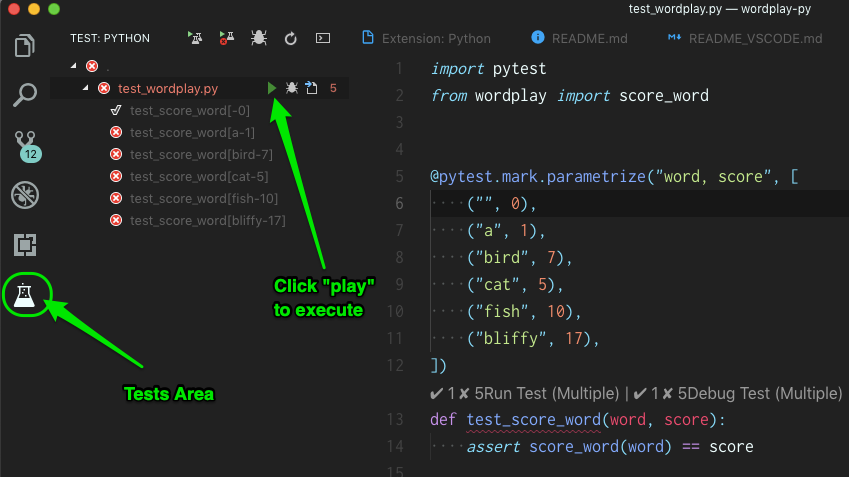

# Wordplay: VS Code Configuration

Additional VS Code instructions that accompany the [Wordplay mini project](https://github.com/PDXPythonPirates/wordplay).

# Contents
- [References](#references)
- [Quick Set Up](#quick-set-up)

# References
- [VS Code home page](https://code.visualstudio.com/)
- [Python in VS Code](https://code.visualstudio.com/docs/languages/python)
- [VS Code Python tutorial](https://code.visualstudio.com/docs/python/python-tutorial)
- [VS Code Git support](https://code.visualstudio.com/docs/editor/versioncontrol#_git-support)

# Quick Set Up
1) Open _Extensions_ in the lefthand nav, search for and install the **Python** extension.  
    
2) Review the guide on [VS Code and python virtual environments](https://code.visualstudio.com/docs/python/environments).
2) Select your Python interpreter via the Command Palette:  
  Go to menu _View > Command Palette_  
  Type and select `Python: Select Interpreter`  
  Select your virtual env from the list (look for "pipenv")
3) Configure this project for **pytest** via the Command Palette:  
  Go to menu _View > Command Palette_  
  Type and select `Python: Configure Unit Tests`  
  Select `.` for the directory.
4) Configure the VS code terminal to use the virtual environment.  
  Open the project configuration file `.vscode/settings.json`  
  Add the following line to the JSON:  
  `"python.terminal.activateEnvironment": true,`  
  You should have something like:  
  ```json
  {
    "python.pythonPath": "/some/path/in/your/workspace",
    "python.terminal.activateEnvironment": true,
    "python.unitTest.pyTestArgs": [
        "."
    ],
    "python.unitTest.unittestEnabled": false,
    "python.unitTest.nosetestsEnabled": false,
    "python.unitTest.pyTestEnabled": true
  }
  ```
5) Close and relaunch VS Code.
6) Run `pytest` from the built in command prompt.  
  If VS Code does not automatically activate your virtual environment, request it specifically:  
  Go to menu _View > Command Palette_  
  Type and select `Terminal: Create New Integrated Terminal (In Active Workspace)`  
  You can confirm your virtual environment is active when `(wordplay)` is displayed in the prompt.  
  From the command prompt type and execute:  
  `pytest -v`
7) Run `pytest` from the GUI.  
  Select the chemistry flask icon on the left to open the test palette.  
  Click the collapse/expand triangle to the left of "test_wordplay.py" to see all tests.  
  Click the **green play** button to execute the tests.  
  
8) Git branches can be managed and changed using the control in the bottom left corner.  


